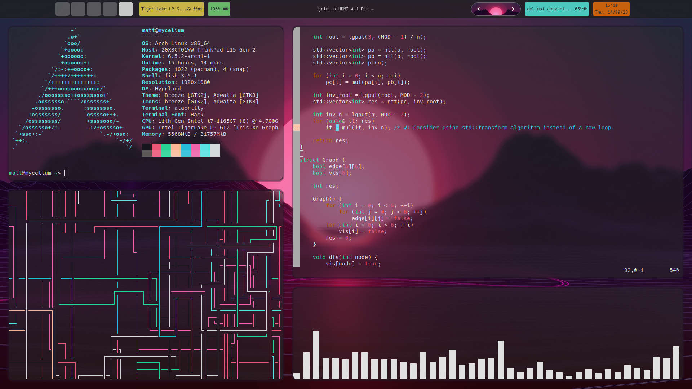
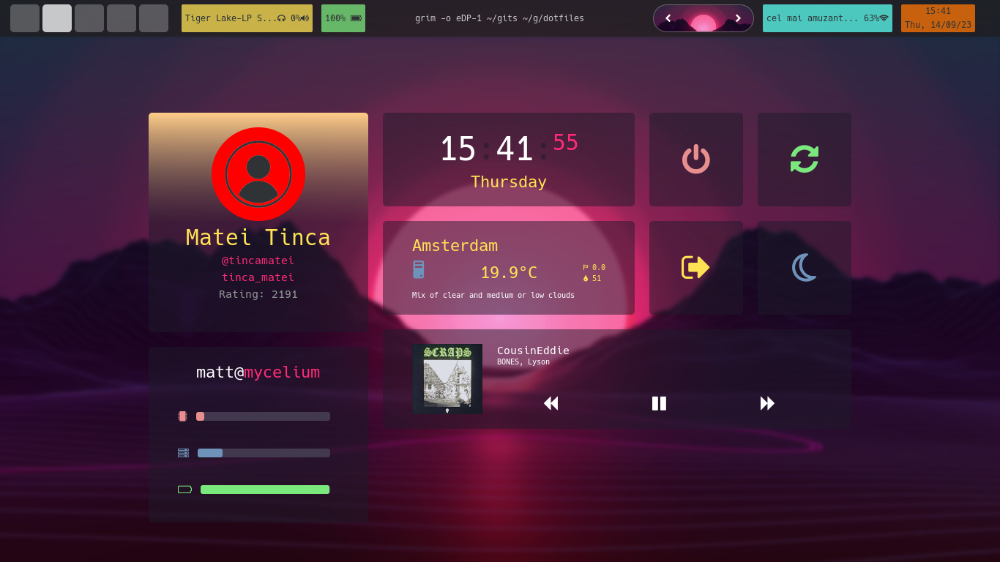

# dotfiles

* OS: [Arch Linux](https://archlinux.org/)
* WM: [Hyprland](https://hyprland.org/)
* Bar: [Eww](https://github.com/elkowar/eww)
* Dashboard: [Eww](https://github.com/elkowar/eww)
* Terminal: [Alacritty](https://github.com/alacritty/alacritty)
* Shell: [Fish](https://fishshell.com/)
* Wallpaper Engine: [swww](https://github.com/Horus645/swww)
* Font: [Hack](https://github.com/source-foundry/Hack)
* Application launcher: [rofi](https://github.com/davatorium/rofi)
    * Rofi theme: [Type 6, Style 10](https://github.com/adi1090x/rofi)
* Notification daemon: [mako](https://github.com/emersion/mako)
    * Mako theme: [Catppuccin](https://github.com/catppuccin/mako)
* Lockscreen: [swaylock-effects](https://github.com/mortie/swaylock-effects)
* Screenshots: [grim](https://github.com/emersion/grim), [flameshot](https://flameshot.org/)
* Text editor: [vim](https://www.vim.org/)

## Hyprland keybinds

| Bind | Action |
|------|--------|
| `SUPER + q` | Open terminal |
| `SUPER + SHIFT + w` | Close active window |
| `SUPER + m` | Exit session |
| `SUPER + v` | Toggle floating window |
| `SUPER + c` | Open browser |
| `SUPER + j` | Toggle split |
| `SUPER + f` | Toggle fullscreen mode |
| `SUPER + k` | Send current workspace to HDMI monitor |
| `SUPER + l` | Send current workspace to main screen |
| `SUPER + arrow` | Shift focus to another window |
| `SUPER + SHIFT + arrow` | Resize active window |
| `SUPER + digit` | Move to workspace |
| `SUPER + SHIFT + digit` | Move current window to workspace |
| `SUPER + scroll` | Scroll through workspaces |
| `SUPER + o/p` | Scroll through workspaces |
| `SUPER + left-click` | Move window |
| `SUPER + right-click` | Resize window |
| `SUPER + r` | Launch rofi |
| `SUPER + tab` | Open dashboard and lock screen |
| `SUPER + p` | Open screenshot GUI |

